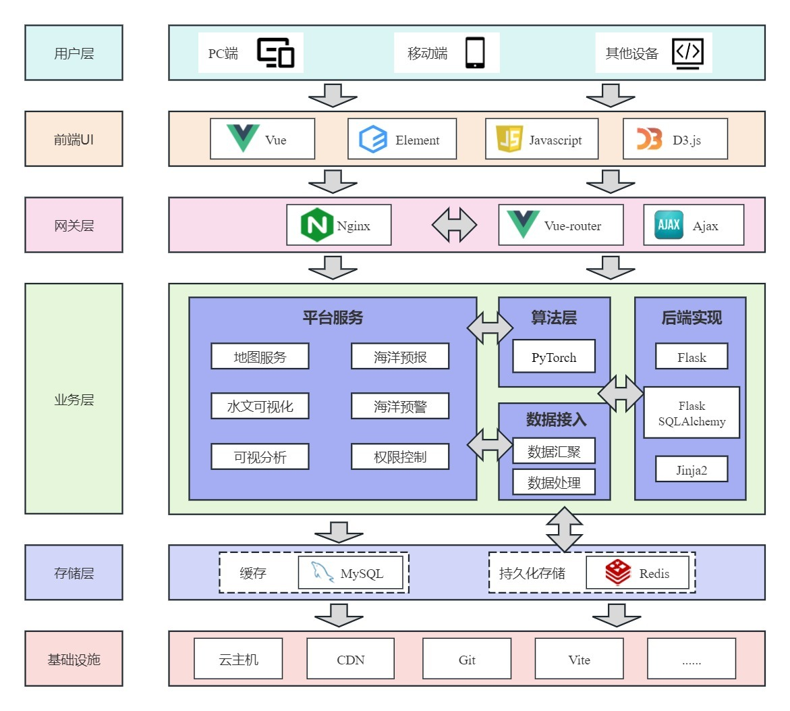
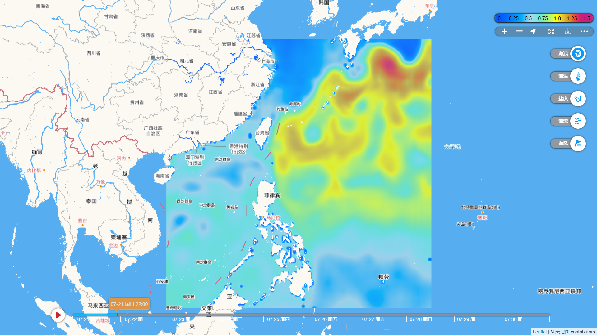
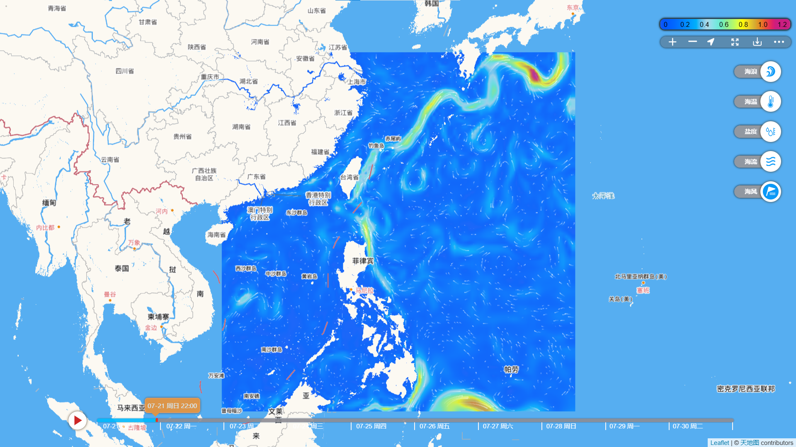
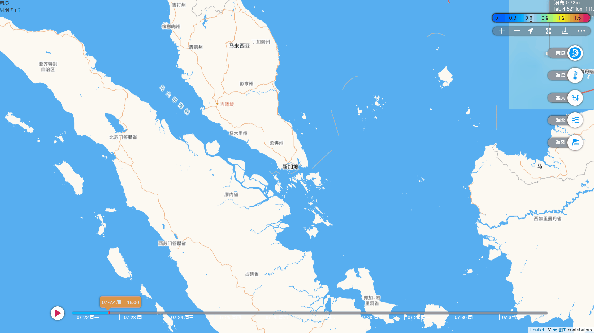

# 海洋生态环境与环境要素的智能预报系统

#### Introduction

    本项目依次使用并改进了[U-Net](https://github.com/xuebinqin/U-2-Net)、[ConvLSTM](https://blog.csdn.net/weixin_39753819/article/details/136016677)和[ISAM4VP](https://github.com/seominseok0429/Implicit-Stacked-Autoregressive-Model-for-Video-Prediction)三种算法，在海洋要素预测模块中将其实现。在进行算法预测精度对比后，最终使用ISAM4VP作为主要模型，并分别训练了预测浪高、盐度、海温、海流和海风五种海洋要素的模型。本项目使用[Vue](https://cn.vuejs.org/)和[Flask](https://flask.github.net.cn/)搭建海洋预报系统的前后端，使用D3.js进行海洋预报数据可视化，便于用户交互。实际检验表明，本项目中所使用的算法在多个海洋要素上具有很好的适应性与可扩展性，在长时间预报中达到了很高的精度。

* Data

欧洲中期天气预报中心 [ERA5](http://www.era5.co.uk/) 和 [Copernicus](Copernicus) 中2023-2024年的海风、海水温度、海水盐度和浪高等数据

* Map

[天地图](https://www.tianditu.gov.cn/) 提供的地图底图和数据标注

```
https://t4.tianditu.gov.cn/DataServer?T=cva_w&x={x}&y={y}&l={z}&tk=a8479c5bd1fd7b84c5a72669ed79a95b
```

* Data Format

  数据处理后为 `.asc`格式 `wave-2024-07-20T00-00-00.asc`

  ```
  ncols         120
  nrows         120
  xllcorner     110.0
  yllcorner     3.0
  cellsize      0.25
  NODATA_value  0.0
  -0.002297 -0.001717 -0.000114 -0.000363 0.000068 0.000392 -0.000100 0.000262 -0.000247 -0.000342 -0.000169 -0.000141 -0.000226 -0.000126 -0.000208 -0.000041 -0.000303 0.000134 0.000184 0.000312 0.000331 0.000674 0.000542 0.000655 0.000495 0.001015 0.000820 
  ```
* System Architecture



* Project Content

  ```
  ├─.idea
  ├─back-ground
  │  ├─.idea
  │  │  └─inspectionProfiles
  │  ├─API			// API函数存放
  │  ├─results			// 训练结果与模型保存
  │  │  └─Debug
  │  │      └─checkpoints
  ├─dist                          // 打包后的dist文件夹
  ├─node_modules
  ├─public                        // 公共资源文件夹
  │  ├─img
  │  ├─ISAM			// 储存使用ISAM预报的数据
  │  │  ├─currentu_asc
  │  │  ├─......
  │  ├─mapTile			// 本地地图数据
  │  └─test_data			// 测试数据文件
  └─src
      ├─assets
      ├─components		// 组件
      │  └─icons
      ├─modules			// 模块
      ├─pages			// 页面
      └─stores			// 状态
  ```

## Run Environment

```
  frontend
  运行平台: indows 10
  运行环境：node.js >= v18.15 npm >= 9.5.0
  
  backend
  运行平台: windows 10
  运行环境: ython >=3.8
```

## Usage

* Clone

```
git clone https://github.com/jinxiaokuang/ocean-forecast.git
```

* run

```
npm i
npm run dev
// 在浏览器打开本地端口
```

* build

```
npm run build
```

* train&Test
  ```
  pip install -r requirements.txt  

  cd /back-ground
  python run weathermain.py
  ```

修改 `getpredmain.py`以配置参数

## Demo

##### Basic Features

* Wave



* Temperature


* Current



* Current gif


* Wind gif


#### Other features

* Locate

  
* Print

  

## ToDo

1. 将预报数据拓广到全球
2. 对海洋水文要素结束进行进一步的可视分析

## License

Licensed under the MIT license.

## Thanks

[Vue.js](https://cn.vuejs.org/) + [Vite](https://www.vitejs.net/) 提供的项目构建框架

[中国海洋预报网](https://www.oceanguide.org.cn/IndexHome) 提供的海洋水文预报的参照服务

[Windy: Wind map &amp; weather forecast](https://www.windy.com/) 提供的页面搭建参照

[天地图](https://www.tianditu.gov.cn/) 提供的地图底图服务

[iconfont-阿里巴巴矢量图标库](https://www.iconfont.cn/) 提供的icon图标服务

[一个Vue 3 UI 框架 | Element Plus](https://element-plus.org/) 提供的Vue组件服务

[IHCantabria/Leaflet.CanvasLayer.Field: Load and style Raster files in Leaflet ](https://github.com/IHCantabria/Leaflet.CanvasLayer.Field/?tab=readme-ov-file)提供的风场可视化

[wind-layer | 风场插件 (sakitam.com)](https://blog.sakitam.com/wind-layer/) 提供的风场可视化与数据加载服务
